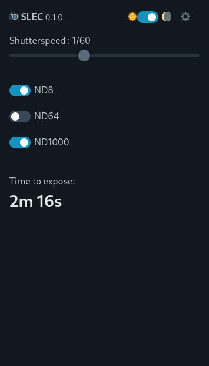

# SLEC
SLEC - **S**orcerers **L**ong **E**xposure **C**alculator - A simple photography tool to calculate shutter 
time for long exposures when using ND filters.

## Screenshot

A picture is worth a thousand words ...



## Motivation

Most existing apps to help photographers with long exposures are paid ones.
Using a de-googled phone includes having no Play-Store available
to purchase/install those apps. There are options to purchase and install paid apps, 
but you still need to use a Google Account which I like to avoid. There are also several
web based tools available, but I haven't found any I really liked.
A second motivation is to learn and gain some experience with a RUST frontend framework 
that compiles to WASM (in this case Dioxus).

## Live

[https://sorcerersr.github.io/](https://sorcerersr.github.io/)


## Prerequisite

At the time of writing follow https://dioxuslabs.com/learn/0.4/getting_started/wasm

In short

```
cargo install dioxus-cli
rustup target add wasm32-unknown-unknown
```

Running dev server:

```
dx serve
```