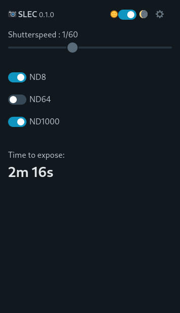

# SLEC

SLEC - **S**orcerers **L**ong **E**xposure **C**alculator - A simple photography tool to calculate shutter
time for long exposures when using ND filters.

## Screenshot

A picture is worth a thousand words ...



## Motivation

Most existing apps to help photographers with long exposures are paid ones.
Using a de-googled phone includes having no Play-Store available
to purchase/install those apps. There are options to purchase and install paid apps,
but you still need to use a Google Account which I like to avoid. There are also several
web based tools available, but I haven't found any I really liked.
A second motivation is to learn and gain some experience with a RUST frontend framework
that compiles to WASM (in this case Dioxus).

## Live

[https://sorcerersr.github.io/SLEC/](https://sorcerersr.github.io/SLEC/)

## Prerequisite

At the time of writing follow https://dioxuslabs.com/learn/0.7/getting_started/
In short

```
rustup toolchain install stable
rustup target add wasm32-unknown-unknown
```

and install dioxus-cli (check the dioxus docs for more installation options)

```
curl -sSL https://dioxus.dev/install.sh | bash
```

Running dev server:

```
dx serve --platform web
```

## Development

Coverage: llmv-cov

```
cargo install cargo-llvm-cov --locked
```

get coverage report in terminal:
```
cargo llvm-cov
```